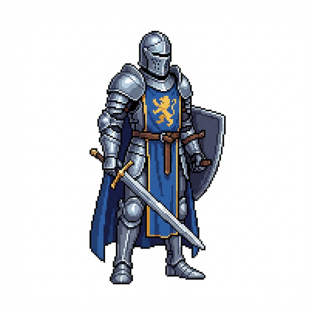
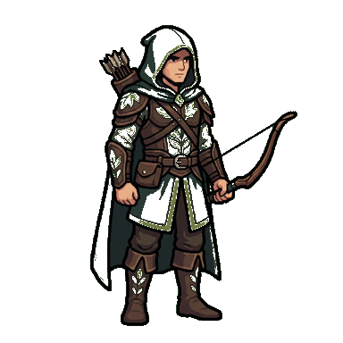
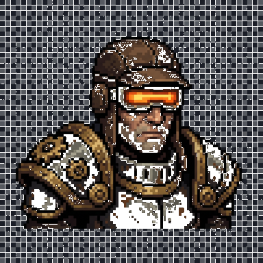
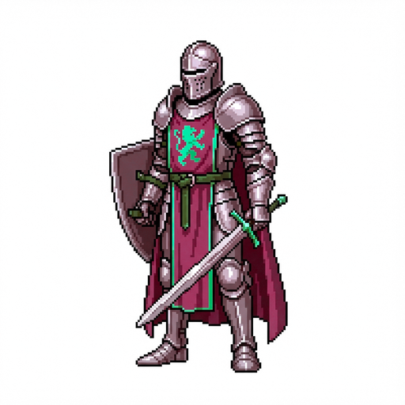
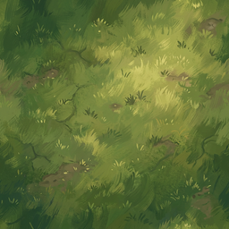
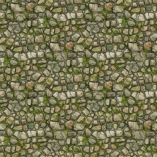

# AISpriteGenerator CLI

Generate game-ready sprite images from prompts, directly from the command line.

Primary model target: Google Vertex AI Gemini image preview model
`gemini-3-pro-image-preview` (often referred to as "Nano Banana").

## Who This Is For

- Game devs who want fast art iteration.
- Teams scripting image generation in CI or local tooling.
- AI agents that need a simple CLI contract.

## Install

```bash
npm install -g aispritegenerator-cli
```

Both command names are available after install:
- `aispritegenerator-cli` (primary)
- `spritegen-agent` (alias)

## Install Codex Skill

Install the bundled image-generation skill into your current repo:

```bash
aispritegenerator-cli install --skills
```

Install globally into `$CODEX_HOME/skills` (or `~/.codex/skills`):

```bash
aispritegenerator-cli install --skills --global
```

Custom destination and overwrite:

```bash
aispritegenerator-cli install --skills --target /path/to/skills --force
```

## Create Vertex Credentials (Service Account Key)

1. Create or select a Google Cloud project in the Google Cloud Console.
2. Enable the Vertex API for that project:
`https://console.cloud.google.com/apis/library/aiplatform.googleapis.com`
3. Go to `IAM & Admin -> Service Accounts`, create a service account for this CLI.
4. Grant roles to that service account:
- `Vertex AI User` (`roles/aiplatform.user`)
- `Service Usage Consumer` (`roles/serviceusage.serviceUsageConsumer`)
5. Open the service account, go to `Keys`, and create a new JSON key.
6. Save the JSON file somewhere safe on your machine (never commit it to git).
7. Point the CLI at it with `--credentials`, `GOOGLE_APPLICATION_CREDENTIALS`, or `auth login`.

## 60-Second Quickstart

1. Save your Vertex defaults once:

```bash
spritegen-agent auth login \
  --project-id your-gcp-project-id \
  --credentials /absolute/path/to/service-account.json \
  --location global \
  --model-id gemini-3-pro-image-preview
```

2. Generate one image:

```bash
spritegen-agent generate \
  --prompt "top-down pixel art copper ore icon" \
  --count 1 \
  --width 256 \
  --height 256 \
  --output-dir ./out \
  --prefix copper-ore
```

If this works, you are ready to batch generate.

## Example Gallery

These were generated with this CLI and committed as examples:

| Characters | Characters |
|---|---|
|  |  |
|  |  |

| Terrain Tiles | Terrain Tiles |
|---|---|
|  |  |

Use these prompts as a starting point:
- `Full-body 2D game sprite of a heroic fantasy knight in steel armor with blue tabard, idle pose, centered, clean silhouette, high detail, no text.`
- `Full-body 2D game sprite portrait of a fantasy ranger wearing green hood and leather armor, centered subject, clean silhouette, game art, no text.`
- `2D game sprite portrait of a dieselpunk mech pilot with glowing visor and metal shoulder pads, centered subject, clean silhouette, game art, no text.`
- `Full-body 2D game sprite portrait of an arcane mage with long robe and glowing staff, idle pose, centered, clean silhouette, game art, no text.`
- `Seamless top-down painted grass terrain tile texture for strategy game map, no objects, no text, no border seams.`
- `Seamless top-down cobblestone terrain tile texture for fantasy town map, no objects, no text, no border seams.`

## Common Workflows

Generate one icon:

```bash
spritegen-agent generate \
  --prompt "isometric iron ore game icon" \
  --count 1 \
  --width 128 \
  --height 128 \
  --output-dir ./out \
  --prefix iron-ore
```

Generate 20 variations:

```bash
spritegen-agent generate \
  --prompt "fantasy potion bottle icon, game UI style" \
  --count 20 \
  --seed-start 1000 \
  --output-dir ./out \
  --prefix potion
```

Generate transparent sprites:

```bash
spritegen-agent generate \
  --prompt "2d game tree stump, centered subject" \
  --count 8 \
  --transparent \
  --formats png,webp \
  --output-dir ./out \
  --prefix tree-stump
```

`--transparent` enables two-pass transparent-background extraction. Without it, generation is single-pass and opaque by default.

Edit an existing image while preserving the source as a visual reference:

```bash
spritegen-agent edit \
  --input-image ./nixie-original.png \
  --prompt "Edit only the clothing into a blue-white fantasy bikini beach skin. Preserve the original pose, face, hair, proportions, magic effects, art style, and full-body framing." \
  --count 3 \
  --width 1088 \
  --height 1024 \
  --transparent \
  --formats png \
  --output-dir ./out \
  --prefix nixie-beach
```

`edit` sends the source image to Vertex along with the prompt. Use surgical prompts for source-preserving work:

- Say exactly what may change.
- Say exactly what must remain unchanged.
- Keep `--width` and `--height` equal to the target game asset size.
- Add `--transparent` for PNG/WebP assets that need alpha. In edit mode, the CLI preserves the source image alpha matte after the model edit, which is best for sprite/character skins that should keep the original canvas and silhouette.

## What You See While It Runs

- Live progress is emitted as JSON lines on `stderr` (`stream: "progress"`).
- Final run result is emitted as JSON on `stdout`.
- Exit code is non-zero if any item failed.

Progress event types:
- `run-start`
- `item-start`
- `item-heartbeat`
- `item-retry`
- `item-done`
- `item-failed`
- `run-complete`

Split streams if you are automating:

```bash
spritegen-agent generate ... 1>run-report.json 2>run-progress.log
```

## Agent/Automation Notes

- Treat `stdout` JSON as source of truth.
- Check `summary.failed`; if `> 0`, treat the run as failed.
- Use `items[].outputs[].path` to collect generated files.
- Use `items[].error` for per-item diagnostics.

## Configuration

Environment variables:
- `SPRITEGEN_AGENT_PROFILE`
- `VERTEX_PROJECT_ID`
- `GOOGLE_APPLICATION_CREDENTIALS`
- `VERTEX_LOCATION` (default: `global`)
- `VERTEX_MODEL_ID` (default: `gemini-3-pro-image-preview`)

Resolution order:
- CLI flags
- Environment variables
- Saved profile (`auth login`)
- Built-in defaults (`global`, `gemini-3-pro-image-preview` / "Nano Banana")

## Common Failures

| Symptom | Likely cause | Fix |
|---|---|---|
| Missing project id error | `VERTEX_PROJECT_ID` not set and no saved profile | Pass `--project-id` or run `auth login` |
| Credentials path missing/unreadable | Invalid `GOOGLE_APPLICATION_CREDENTIALS` or missing `--credentials` | Point to a valid service account JSON file |
| Permission denied from Vertex | Service account lacks required IAM permissions | Update IAM roles on the project |
| Long retries / overload | Vertex transient capacity issues | Increase timeout/retry options and let backoff continue |

## Command Reference

```bash
aispritegenerator-cli --help
aispritegenerator-cli --version
aispritegenerator-cli edit --input-image <path> --prompt <text> --count <n> [--transparent]
aispritegenerator-cli install --skills
aispritegenerator-cli auth status
aispritegenerator-cli auth logout
```

## Development

```bash
npm install
npm run lint
npm test
npm run build
```

## Publishing

```bash
npm login
npm run lint
npm test
npm run build
npm publish --access public
```

## License

MIT
